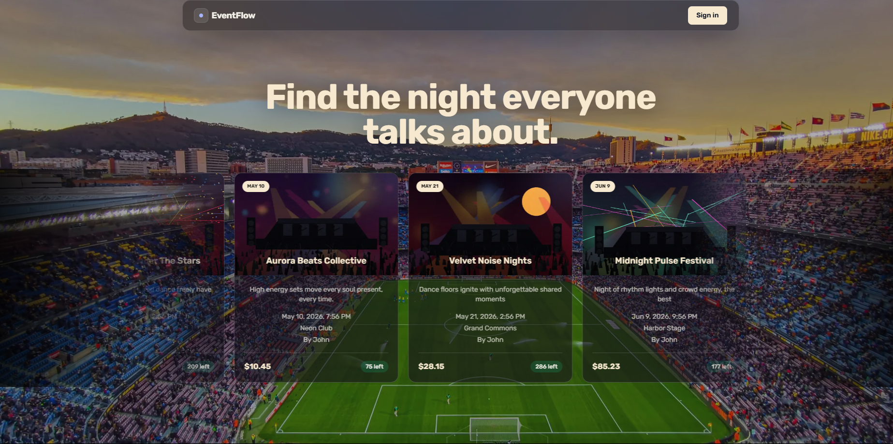
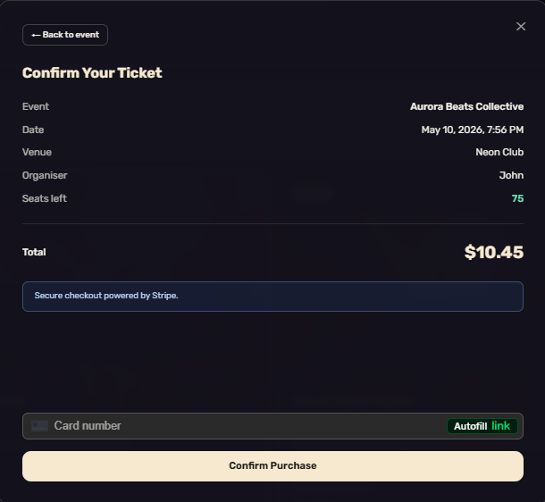
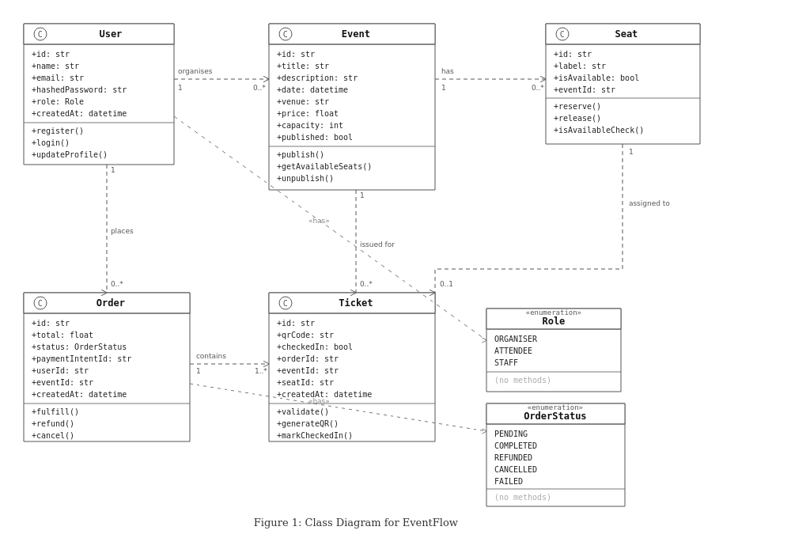
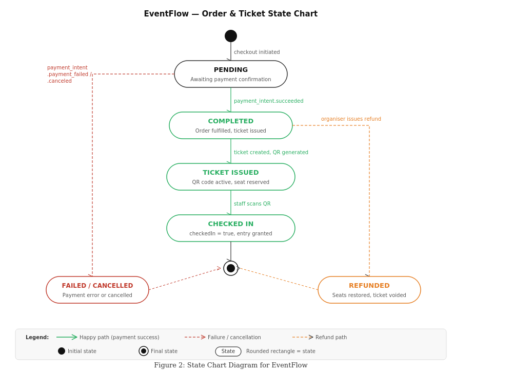

# EventFlow 🎟️

> A full-stack multi-role event ticketing platform built with Next.js 14,
> TypeScript, Prisma, PostgreSQL, and Stripe.



---

## 🌐 Live Demo

🔗 [eventflow-neon-six.vercel.app](https://eventflow-neon-six.vercel.app)

---

## 📌 Overview

EventFlow is a production-ready event ticketing web application that connects
three types of users in one seamless platform:

- **Organisers** create and publish events, manage orders, track revenue, and
  issue refunds
- **Attendees** browse events, purchase tickets via Stripe, and receive a
  scannable QR code ticket
- **Staff** validate attendee entry at the door using a live camera QR scanner
  or manual UUID entry

---

## ✨ Features

### 🎭 Organiser
- Create, edit, publish, and unpublish events
- Upload event images to Supabase Storage
- View revenue analytics and tickets sold per event
- Manage orders and issue Stripe refunds
- Automatic seat generation on event creation

### 🎫 Attendee
- Browse and search all published events
- View event details in a modal with seat availability
- Purchase tickets securely via Stripe
- View all tickets with QR codes after purchase
- Real-time seat availability updates

### 🔍 Staff
- Camera-based QR code scanner for ticket validation
- Manual UUID entry as fallback
- Duplicate check-in prevention
- Instant success/failure feedback banners

---

## 📸 Screenshots

### Home Page


### Login & Register
| Login | Register |
|-------|----------|
|  |  |

### Attendee Dashboard


### Event Detail Modal


### Stripe Checkout


### Ticket & QR Code
| Ticket View | QR Code |
|-------------|---------|
|  |  |

### Organiser Dashboard


### Staff QR Scanner


---

## 🛠️ Tech Stack

| Layer | Technology |
|-------|------------|
| Framework | Next.js 14 (App Router) |
| Language | TypeScript |
| Styling | Tailwind CSS |
| ORM | Prisma |
| Database | PostgreSQL (Supabase) |
| Authentication | NextAuth.js |
| Payments | Stripe (PaymentIntents + Webhooks) |
| Image Storage | Supabase Storage |
| Deployment | Vercel |

---

## 🗄️ Database Schema
User
├── id, name, email, hashedPassword
├── role: ORGANISER | ATTENDEE | STAFF
└── relations: Events, Orders, Tickets
Event
├── id, title, description, date, venue
├── price, capacity, published, imageUrl
└── relations: Seats, Orders, Tickets
Seat
├── id, label, isAvailable
└── relations: Ticket
Order
├── id, total, paymentIntentId
├── status: PENDING | COMPLETED | REFUNDED | CANCELLED | FAILED
└── relations: Tickets
Ticket
├── id, qrCode, checkedIn
└── relations: Order, Event, Seat
---

## 📐 System Design

### UML Class Diagram


### State Chart Diagram


---

## 🚀 Getting Started

### Prerequisites
- Node.js 18+
- PostgreSQL database (Supabase recommended)
- Stripe account
- Supabase account

### Installation

1. **Clone the repository**
```bash
git clone https://github.com/Bibekmagar204/Eventflow.git
cd Eventflow
```

2. **Install dependencies**
```bash
npm install
```

3. **Set up environment variables**

Copy `.env.example` to `.env` and fill in your values:
```bash
cp .env.example .env
```

```env
# Database
DATABASE_URL=""
DIRECT_URL=""

# NextAuth
NEXTAUTH_URL=""
NEXTAUTH_SECRET=""

# Stripe
STRIPE_SECRET_KEY=""
NEXT_PUBLIC_STRIPE_PUBLISHABLE_KEY=""
STRIPE_WEBHOOK_SECRET=""

# Supabase
NEXT_PUBLIC_SUPABASE_URL=""
SUPABASE_SERVICE_ROLE_KEY=""
SUPABASE_EVENT_IMAGES_BUCKET="event-images"
```

4. **Set up the database**
```bash
npx prisma migrate dev
npx prisma generate
```

5. **Run the development server**
```bash
npm run dev
```

Open [http://localhost:3000](http://localhost:3000) in your browser.

---

## 📁 Project Structure
eventflow/
├── app/
│   ├── (auth)/          # Login & register pages
│   ├── (organiser)/     # Organiser dashboard & event management
│   ├── (attendee)/      # Browse events & ticket pages
│   ├── (staff)/         # QR scanner page
│   └── api/             # REST route handlers
├── components/          # Shared React components
├── lib/                 # Utilities: auth, prisma, stripe, qr
├── prisma/
│   └── schema.prisma    # Database schema
├── prompts/             # AI prompt documentation
├── public/
│   └── screenshots/     # App screenshots
└── middleware.ts        # Role-based route protection
---

## 🔐 Role-Based Access

| Route | ORGANISER | ATTENDEE | STAFF |
|-------|-----------|----------|-------|
| /organiser/dashboard | ✅ | ❌ | ❌ |
| /attendee/browse | ❌ | ✅ | ❌ |
| /staff/scanner | ❌ | ❌ | ✅ |
| /login & /register | ✅ | ✅ | ✅ |

---

## 💳 Stripe Payment Flow
Attendee selects seat
↓
POST /api/checkout/intent
(creates PaymentIntent + PENDING order)
↓
Stripe Elements UI (card input)
↓
Stripe processes payment
↓
POST /api/checkout/webhook
(payment_intent.succeeded)
↓
Prisma $transaction:

Order → COMPLETED
Ticket created with QR code
Seat → isAvailable: false
↓
Attendee sees QR ticket
---

## ✅ Acceptance Test Cases

| ID | Test Case | Actor | Result |
|----|-----------|-------|--------|
| TC-01 | User Registration & Login | Attendee | ✅ PASS |
| TC-02 | Organiser Creates & Publishes Event | Organiser | ✅ PASS |
| TC-03 | Attendee Purchases Ticket via Stripe | Attendee | ✅ PASS |
| TC-04 | Staff QR Scanner Check-In | Staff | ✅ PASS |
| TC-05 | Organiser Issues Refund | Organiser | ✅ PASS |

---

## 👥 Team

| Name | GitHub |
|------|--------|
| Bibek Magar | [@Bibekmagar204](https://github.com/Bibekmagar204) |
| Nolan Martin | [@dyyo](https://github.com/dyyo) |

---

## 📚 Course

CS 4398 · Software Engineering Project
Texas State University · May 2026

**Team contacts:**
- Bibek Magar — rns94  Github: Bibekmagar204
- Nolan Martin — nmm107  Github: Dyyo

---

## 📄 License

This project was built for academic purposes as part of a university Software Engineering course.
